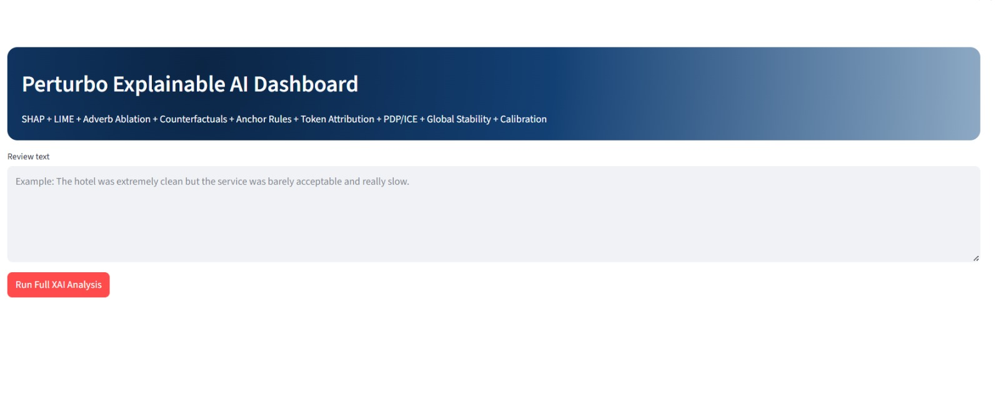
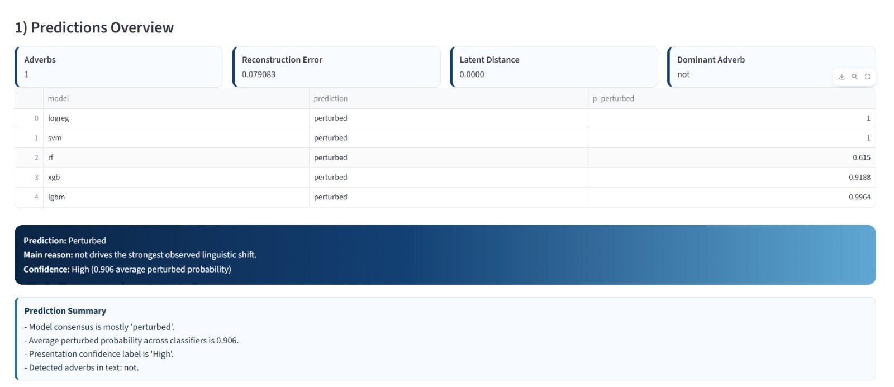
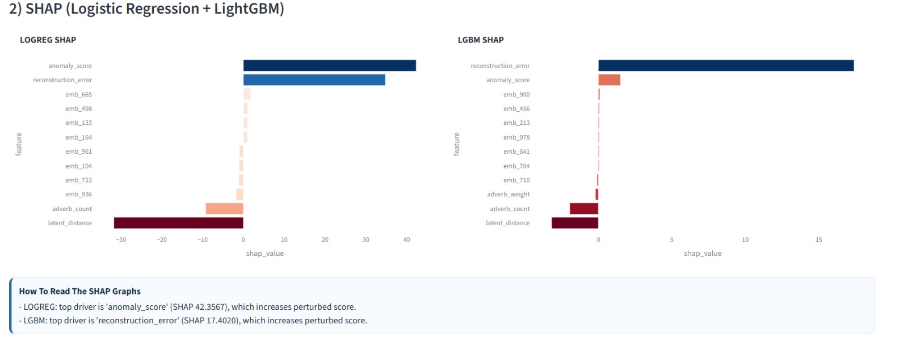
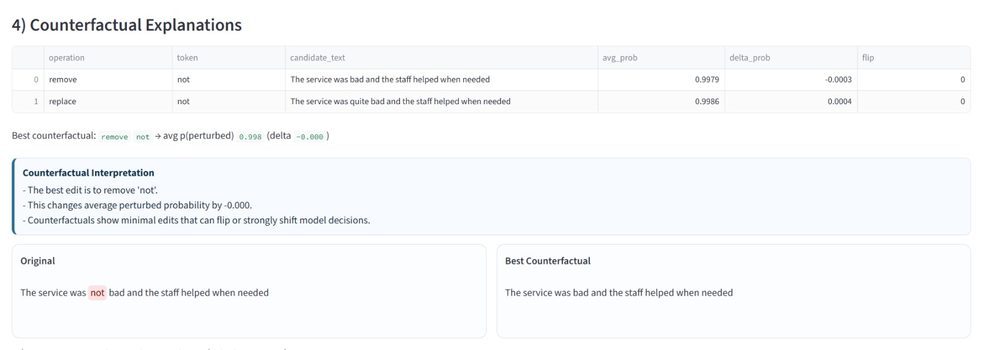
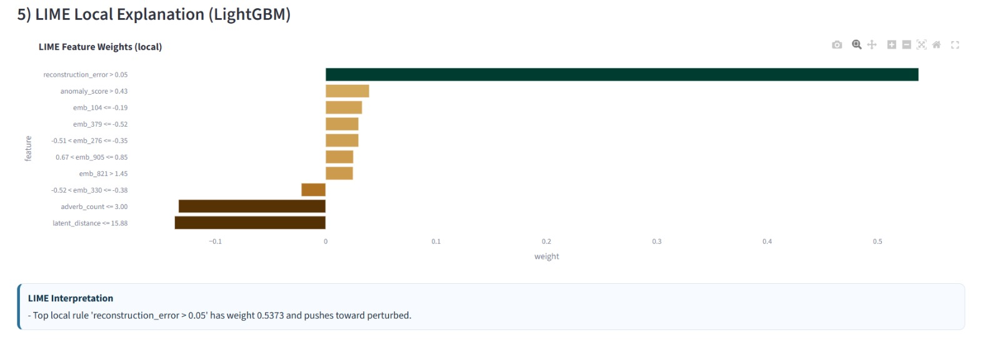
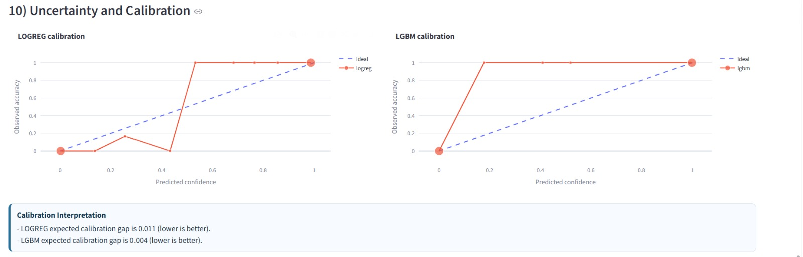

# Autoencoder-Based Adversarial Perturbation Detection Using Transfer Learning

## Overview
This project presents an end-to-end machine learning pipeline for detecting adversarial perturbations in review text using transfer learning, hybrid feature engineering, and multiple classification models. It is designed around TripAdvisor-style review data and focuses on identifying manipulated or suspicious text inputs that may affect model reliability.

The repository includes data preprocessing scripts, training workflows, saved model artifacts, evaluation outputs, and a Streamlit application for interactive testing. The system combines semantic text embeddings with additional engineered features to improve robustness and predictive performance.

## Objectives
- Detect adversarial or perturbed review text
- Compare multiple machine learning models on the detection task
- Use transfer learning-based embeddings for stronger text representation
- Provide an interactive Streamlit interface for testing and analysis
- Support reproducible experimentation with saved models and utilities

## Features
- Transfer learning-based text embeddings
- Hybrid feature engineering pipeline
- Multiple trained ML models for comparison
- Model evaluation and result visualization
- Streamlit web app for interactive inference
- Utility scripts for preprocessing, training, and analysis

## Tech Stack
- Python
- Streamlit
- Scikit-learn
- PyTorch
- NumPy
- Pandas
- Joblib
- XGBoost
- LightGBM

## Project Structure
```text
perturbo/
  perturbo_streamlit/
    app.py
    data/
    models/
    src/
    requirements.txt
```

## Main Components
- `app.py`: Streamlit app for running predictions and interacting with the system
- `data/`: datasets and processed feature files
- `models/`: trained model files and saved artifacts
- `src/`: helper modules for training, utilities, and explainability
- training scripts: model comparison and preprocessing workflows

## Use Cases
- Detecting adversarial perturbations in review text
- Studying robustness in NLP classification systems
- Comparing ML models on text-security tasks
- Demonstrating an applied ML project with deployment support

## Getting Started
1. Clone the repository:
```bash
git clone https://github.com/thanujv8277/Autoencoder-Based-Adverserial-Perturbation-Detection-Using-Transfer-Learning.git
cd Autoencoder-Based-Adverserial-Perturbation-Detection-Using-Transfer-Learning
```

2. Install dependencies:
```bash
pip install -r perturbo/perturbo_streamlit/requirements.txt
```

3. Run the Streamlit app:
```bash
streamlit run perturbo/perturbo_streamlit/app.py
```

## Screenshots
### Dashboard Home


### Predictions Overview


### SHAP Analysis


### Counterfactual Explanations


### LIME Local Explanation


### Uncertainty and Calibration


## Future Improvements
- Add Git LFS support for large model artifacts
- Improve README with screenshots and sample outputs
- Add clearer experiment tracking and metrics summaries
- Containerize deployment with Docker
- Expand the dataset and adversarial attack coverage

## Summary
This project demonstrates how transfer learning, feature engineering, and machine learning can be combined to build a practical adversarial perturbation detection system for review text. It serves both as a research-oriented experiment pipeline and as a deployable application for interactive testing.
